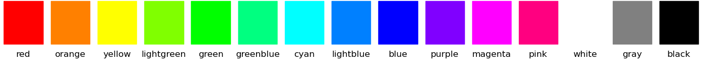
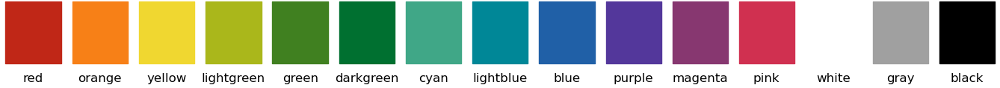
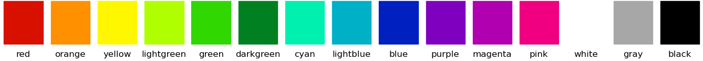
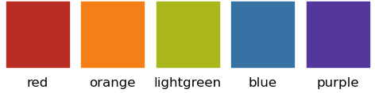
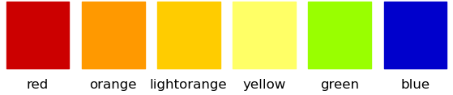
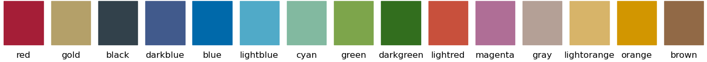
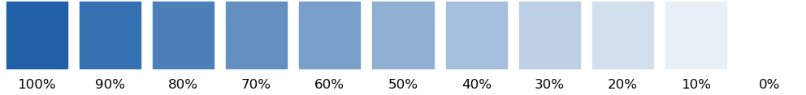
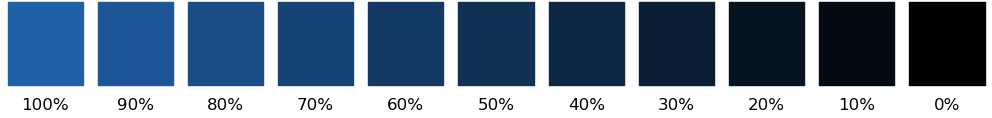
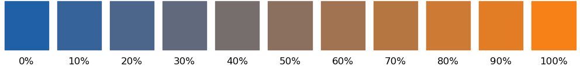

# Colors module

```
import plottools.colors as c
```

## Color palettes

The color module provides a few color palettes as dictionaries that
reference colors by standard color names. For example:
```
c.colors_muted['red']
```
returns the red color of the `colors_muted` palette. The returned
colors are valid matplotlib colors and can be passed on to `color`,
`facecolor`, `edgecolor`, etc. arguments of the various plotting
functions.

The following sections display the colors of all palettes together
with their names.

```
c.color
```
is a default color palette set to one of the available color palettes
(currently ```colors_muted```). Feel free to overwrite it.

```
c.color_palettes
```
is a dictionary referencing all color palettes provoded by the module
by their name.


### Plain RGB colors

```
c.colors_plain
```




### Muted colors

```
c.colors_muted
```




### Vivid colors

```
c.colors_vivid
```




### Color palette by J&ouml;rg Henninger

```
c.colors_henninger
```




### Color pallete of our Scientific Computing script

```
c.colors_scicomp
```




### Color palette of the corporate design of the University of T&uuml;bingen

```
c.colors_unituebingen
```




## Color manipulation

### Lighter colors

Make colors lighter.



For 40% lightness of blue do
```
color = c.colors['blue']
lightblue = c.lighter(color, 0.4)
```


### Darker colors

Make colors darker.



For 40% darker blue do
```
color = c.colors['blue']
darkblue = c.darker(color, 0.4)
```


### Gradient between two colors

Mix two colors.



For 40% transition between blue and orange do
```
cb = c.colors['blue']
co = c.colors['orange']
color = c.gradient(cb, co, 0.4)
```


## LaTeX colors

If you want to use in your LaTeX document the same colors as in your plots,
then you can export matplotlib colors using the `latex_colors()` function.
Either for single colors:
```
c.latex_colors(c.colors['red'], 'red')
```
writes to the console
```
\definecolor{red}{RGB}{0.753,0.153,0.090}
```
or for a whole palette:
```
c.latex_colors(c.colors_vivid)
```
writes to the console
```
\definecolor{red}{RGB}{0.843,0.063,0.000}
\definecolor{orange}{RGB}{1.000,0.565,0.000}
\definecolor{yellow}{RGB}{1.000,0.969,0.000}
...
```


## Display colors

For displaying colors, three functions are provided:
- `plot_colors()`: plot all colors of a palette and optionally some lighter and darker variants.
- `plot_complementary_colors()`: plot complementary colors of a palette on top of each other.
- `plot_color_comparison()`: plot matching colors of severals palettes on top of each other.

These functions are helpfull when creating new palettes. See their
documentation for details on how to use them.


