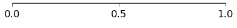
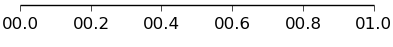
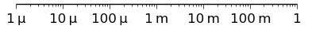
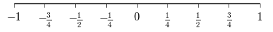
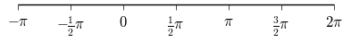
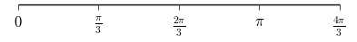
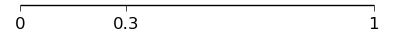
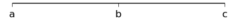
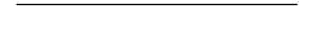

# Ticks module

The `ticks` module adds a couple of functions to
`matplotlib.axes.Axes` as shortcuts to the locators and formatters
provided by `matplotlib.ticker`.

Here, their usage is demonstrated for the x-axis, but of course the
equivalent functions for the y-axis exist as well. Simply replace
`xticks` by `yticks` in the function name.

```
import numpy as np
import matplotlib.pyplot as plt
import plottools.ticks

fig, ax = plt.subplots()
```

## Increments

```
ax.set_xticks_delta(0.5)
```



## Custom format

```
ax.set_xticks_format('%04.1f')
```



## SI unit prefixes

```
ax.set_xscale('log')
ax.set_xlim(1e-6, 1e0)
ax.set_xticks_prefix()
```



## Fractions

```
ax.set_xlim(-1, 1)
ax.set_xticks_fracs(4)
```



## Multiples of Pi

```
ax.set_xlim(-np.pi, 2*np.pi)
ax.set_xticks_pifracs(2)
```



## Pi in the denominator

```
ax.set_xlim(0, 4*np.pi/3)
ax.set_xticks_pifracs(3, True)
```



## Fixed locations

```
ax.set_xticks_fixed((0, 0.3, 1))
```



## Fixed locations and labels

```
ax.set_xticks_fixed((0, 0.5, 1), ('a', 'b', 'c'))
```



## No tick labels

```
ax.set_xticks_blank()
```


You most likely want to use `common_xtick_labels()` from the `axes` module. 


## No ticks at all

```
ax.set_xticks_off()
```

