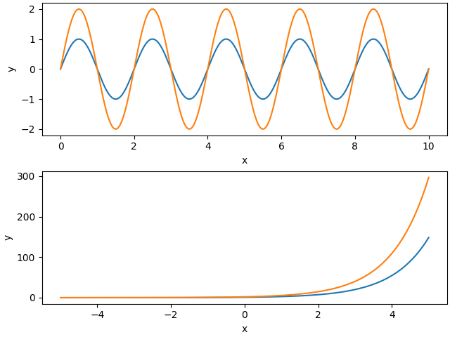
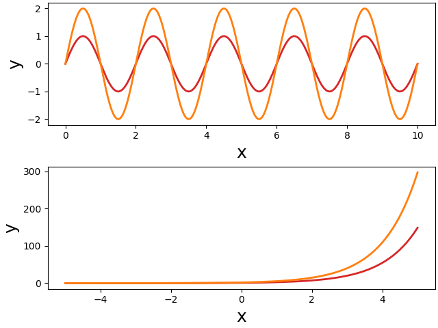
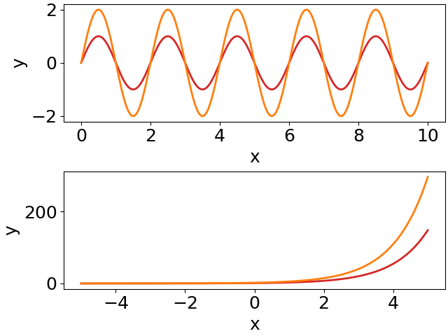
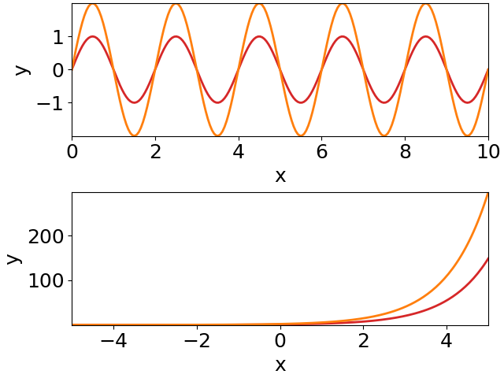

# Coding a figure

There are many different ways how to organize your code. This is also
true for code generating figures. But there are some aspects that
require our attention. In particular, if we want to separate design
from content.

Here we start from some spaghetti code and improve it step-by-step. On
the way we develop some techniques that make your figure code better
maintainable and modifiable.


## Quick-and-dirty spaghetti code

Let's create a figure with two panels on top of each other, showing
two sine waves and two exponential functions. Of course, the two plots
should be properly labeled. Quickly hacking this down results in
something like this:

```py
import numpy as np
import matplotlib.pyplot as plt

# the figure:
fig, (ax1, ax2) = plt.subplots(2, 1, constrained_layout=True)
# some data:
x = np.linspace(0, 10, 200)
y = np.sin(2*np.pi*0.5*x)
# first plot:
ax1.plot(x, y)
ax1.plot(x, 2*y)
ax1.set_xlabel('x')
ax1.set_ylabel('y')
# more data:
x = np.linspace(-5, 5, 200)
y = np.exp(x)
# second plot:
ax2.plot(x, y)
ax2.plot(x, 2*y)
ax2.set_xlabel('x')
ax2.set_ylabel('y')
# save the figure:
fig.savefig('plot.pdf')
```

It produces a figure in the standard design of matplotlib:




## Customize your plot

Well, you do not like the standard appearance of the plots. You want
larger fonts, and you would like to change the color and width of the
plotted lines. You check the documentation of the matplotlib functions
and come up with something like this:

```py
import numpy as np
import matplotlib.pyplot as plt

x = np.linspace(0, 10, 200)
y = np.sin(2*np.pi*0.5*x)
fig, (ax1, ax2) = plt.subplots(2, 1, constrained_layout=True)
ax1.plot(x, y, color='tab:red', lw=2)
ax1.plot(x, 2*y, color='tab:orange', lw=2)
ax1.set_xlabel('x', fontsize=18)
ax1.set_ylabel('y', fontsize=18)
x = np.linspace(-5, 5, 200)
y = np.exp(x)
ax2.plot(x, y, color='tab:red', lw=2)
ax2.plot(x, 2*y, color='tab:orange', lw=2)
ax2.set_xlabel('x', fontsize=18)
ax2.set_ylabel('y', fontsize=18)
fig.savefig('plot.pdf')
```

As intended, the resulting figure has larger labels and modified line styles:




## Modularize your code

This manual and direct way in modifying the plot appearance has
severe disadvantages: if you want to change the design of your figures,
you need to change colors, font sizes, etc. on every line you use
them. Imaging you have many scripts for producing ten figures, each
with many subplots. You do not want to change the hue of your red
color, because this requires to change this color in many places.

The classical solution to this problem is to

- assign all these repetitive plot parameters to variables, and to
- put your code into functions and pull out these parameters as
  function parameters:

```py
import numpy as np
import matplotlib.pyplot as plt

def sine_plot(ax, color1, color2, lw, fs):
    """Plots two sine waves with different amplitudes."""
    x = np.linspace(0, 10, 200)
    y = np.sin(2*np.pi*0.5*x)
    ax.plot(x, y, color=color1, lw=lw)
    ax.plot(x, 2*y, color=color2, lw=lw)
    ax.set_xlabel('x', fontsize=fs)
    ax.set_ylabel('y', fontsize=fs)

def exp_plot(ax, color1, color2, lw, fs):
    """Plots two differently scaled exponential functions."""
    x = np.linspace(-5, 5, 200)
    y = np.exp(x)
    ax.plot(x, y, color=color1, lw=lw)
    ax.plot(x, 2*y, color=color2, lw=lw)
    ax.set_xlabel('x', fontsize=fs)
    ax.set_ylabel('y', fontsize=fs)

# parameters defining plot appearance:
fs = 18
color1 = 'tab:red'
color2 = 'tab:orange'
lw = 2
# the figure:
fig, (ax1, ax2) = plt.subplots(2, 1, constrained_layout=True)
sine_plot(ax1, color1, color2, lw, fs)
exp_plot(ax2, color1, color2, lw, fs)
fig.savefig('plot.pdf')
```

Much better! There are several advantages of this code:

- each subplot is made by a single function and the second part of the
  short main code takes care of their arrangement. This way, the
  subplots can be easily rearranged, or even moved to another figure.
- the appearance of the plots can be controlled entirely from the
  initial part of the short main script.  No need to change anything
  within the functions.

There is, however, one problem. Usually plots are a bit more
complex. Some more lines are plotted, for example, and each would need
its own color and line style parameter. So the number of parameters
tend to explode. And this then makes the functions cumbersome to use,
because in the end one has to follow each parameter into the function
to figure out which color or text it will change. This gets even worse
in case of nested functions.


## Use matplotlib's rcParams

One solution to this problem is provided by matplotlib's
[rcParams](https://matplotlib.org/stable/tutorials/introductory/customizing.html). They
allow you to change basic properties of your plots in a global
manner. That way, you do not need to pass these parameters through
function parameters. In our example, we set the font size via
[rcParams](https://matplotlib.org/stable/tutorials/introductory/customizing.html)
*before* we create the figure:

```py
import numpy as np
import matplotlib.pyplot as plt

# no need to pass font size as a parameter:
def sine_plot(ax, color1, color2, lw):
    x = np.linspace(0, 10, 200)
    y = np.sin(2*np.pi*0.5*x)
    ax.plot(x, y, color=color1, lw=lw)
    ax.plot(x, 2*y, color=color2, lw=lw)
    ax.set_xlabel('x')
    ax.set_ylabel('y')

def exp_plot(ax, color1, color2, lw):
    x = np.linspace(-5, 5, 200)
    y = np.exp(x)
    ax.plot(x, y, color=color1, lw=lw)
    ax.plot(x, 2*y, color=color2, lw=lw)
    ax.set_xlabel('x')
    ax.set_ylabel('y')

# use rcParams to set font size globally:
plt.rcParams['font.size'] = 18
plt.rcParams['figure.constrained_layout.use'] = True
color1 = 'tab:red'
color2 = 'tab:orange'
lw = 2
# the figure:
fig, (ax1, ax2) = plt.subplots(2, 1)
sine_plot(ax1, color1, color2, lw)
exp_plot(ax2, color1, color2, lw)
fig.savefig('plot.pdf')
```

The
[rcParams](https://matplotlib.org/stable/tutorials/introductory/customizing.html)
`font.size` sets the size of all text:



There are additional
[rcParams](https://matplotlib.org/stable/tutorials/introductory/customizing.html)
that allow for a finer control of font sizes.
 

Using
 [rcParams](https://matplotlib.org/stable/tutorials/introductory/customizing.html)
 already removes quite some clutter from your plot functions and it
 also improves the main code, because the parameter lists get shorter.

But there are still too many parameters for defining the appearances
of the plotted lines (and points, and fill styles, ...).


## Plotting styles

Each line you plot has several attributes that you might want to
change. It is not only its color, but also its line width, the line
style (solid or dashed), transparency, etc. If you take it serious,
then all of these should be passed as parameters to the functions that
make the plots. This results in very long parameter lists and requires
many lines of code in your main script setting these parameters.

This explosion of parameters can be nicely reduced to a single
variable for each specific type of line you want to plot. Since these
parameters are supplied as keyword arguments to the plot functions,
they can be combined into dictionaries. Such dictionaries we call
"plotting styles'.

And you can give them functional names. Not `ls_red` intended as a
"line style for drawing a red line", but something like `ls_small` for
a "line style for plotting functions with small amplitudes", for
example. Such functional names turn design into content!

```py
import numpy as np
import matplotlib.pyplot as plt

# pass for each line a line style dictionary:
def sine_plot(ax, ls_small, ls_large):
    x = np.linspace(0, 10, 200)
    y = np.sin(2*np.pi*0.5*x)
    ax.plot(x, y, **ls_small)  # key-word arguments provided by line style
    ax.plot(x, 2*y, **ls_large)
    ax.set_xlabel('x')
    ax.set_ylabel('y')

def exp_plot(ax, ls_small, ls_large):
    x = np.linspace(-5, 5, 200)
    y = np.exp(x)
    ax.plot(x, y, **ls_small)
    ax.plot(x, 2*y, **ls_large)
    ax.set_xlabel('x')
    ax.set_ylabel('y')

plt.rcParams['figure.constrained_layout.use'] = True
plt.rcParams['font.size'] = 18
# define two line styles:
ls_small = dict(color='tab:red', lw=2)
ls_large = dict(color='tab:orange', lw=2)
# the figure:
fig, (ax1, ax2) = plt.subplots(2, 1)
sine_plot(ax1, ls_small, ls_large) # just pass line styles to the functions
exp_plot(ax2, ls_small, ls_large)
fig.savefig('plot.pdf')
```

This way we significantly reduce the number of parameters to the plot
function. And we achieved another big step towards the separation of
design and content. The plot functions just supply the content. How
the plots appear is entirely defined by the initial lines of the main
script.

We can do better.


## Namespace for plotting styles

The
[rcParams](https://matplotlib.org/stable/tutorials/introductory/customizing.html)
control plotting in a global way. Similarly, we could summarize all
our plotting styles in a namespace that we then provide to the
functions creating the plots:

```py
import numpy as np
import matplotlib.pyplot as plt

# just pass a namespace `s` holding some plotting styles:
def sine_plot(ax, s):
    x = np.linspace(0, 10, 200)
    y = np.sin(2*np.pi*0.5*x)
    ax.plot(x, y, **s.lsSmall)  # use line style from namespace
    ax.plot(x, 2*y, **s.lsLarge)
    ax.set_xlabel('x')
    ax.set_ylabel('y')

def exp_plot(ax, s):
    x = np.linspace(-5, 5, 200)
    y = np.exp(x)
    ax.plot(x, y, **s.lsSmall)
    ax.plot(x, 2*y, **s.lsLarge)
    ax.set_xlabel('x')
    ax.set_ylabel('y')

plt.rcParams['figure.constrained_layout.use'] = True
plt.rcParams['font.size'] = 18
# namespace for plotting styles:
class s: pass
# define two line styles in the `s` namespace:
s.lsSmall = dict(color='tab:red', lw=2)
s.lsLarge = dict(color='tab:orange', lw=2)
# the figure:
fig, (ax1, ax2) = plt.subplots(2, 1)
sine_plot(ax1, s)  # just pass the namespace to the functions
exp_plot(ax2, s)
fig.savefig('plot.pdf')
```

Now, we reduced the parameter lists to just two arguments: the axes
and the namespace holding the plotting styles.

Each plot function just gets this namespace. So it is up to the plot
function to select an appropriate plotting style from this
namespace. In all the examples before, the plotting styles were
defined by the caller of the plot functions. By whatever parameters
where passed to the function the design of the plotted lines was
set. By just passing the namespace, we give this control back to the
plot function. And by using functional names for the plotting styles,
the plot functions do not need to make decisions on design.

Key is to use functional names for the plotting styles. In this way it
can be easily ensured that similar things get plotted in the very same
way. You can set a few line styles for stimuli, for example, that were
used to probe the function of a neuron (e.g. `lsStimA`,
`lsStimB`). And a few other styles, for example, for the resulting
responses (e.g. `lsRespA`, `lsRespB`).


## Central function for controlling the design

As a last step we pull out the initial lines of the main script into a
function that we place into a separate module.

This is our `plotstyle.py` module, that defines a `plot_style()`
function. This function returns a namespace with various plotting
styles and sets
[rcParams](https://matplotlib.org/stable/tutorials/introductory/customizing.html):

```py
import matplotlib.pyplot as plt

def plot_style():
    # namespace for plotting styles:
    class s: pass
    s.lsSmall = dict(color='tab:red', lw=2)
    s.lsLarge = dict(color='tab:orange', lw=2)
    # global settings:
    plt.rcParams['figure.constrained_layout.use'] = True
    plt.rcParams['font.size'] = 18
    plt.rcParams['axes.xmargin'] = 0
    plt.rcParams['axes.ymargin'] = 0
    return s
```

And this is how our script looks like:

```py
import numpy as np
import matplotlib.pyplot as plt
from plotstyle import plot_style  # import common plot style

def sine_plot(ax, s):
    x = np.linspace(0, 10, 200)
    y = np.sin(2*np.pi*0.5*x)
    ax.plot(x, y, **s.lsSmall)
    ax.plot(x, 2*y, **s.lsLarge)
    ax.set_xlabel('x')
    ax.set_ylabel('y')

def exp_plot(ax, s):
    x = np.linspace(-5, 5, 200)
    y = np.exp(x)
    ax.plot(x, y, **s.lsSmall)
    ax.plot(x, 2*y, **s.lsLarge)
    ax.set_xlabel('x')
    ax.set_ylabel('y')

s = plot_style()  # use common plot style
# the figure:
fig, (ax1, ax2) = plt.subplots(2, 1)
sine_plot(ax1, s)
exp_plot(ax2, s)
fig.savefig('plot.pdf')
```

A single line of code (the first one of the main script) defines all
the global design of your plot. The remaining main script arranges the
subplots. And the plot functions provide and plot the data and the
content (e.g. axes labels, text, arrows), without setting or
influencing the design.

The design of all the plots can be easily modified in a single place -
the plot style module.

Because we added a few more
[rcParams](https://matplotlib.org/stable/tutorials/introductory/customizing.html),
the figure looks a little bit different:




## How to structure your code

Continue reading with suggestions on [how to structure your
code](structure.md).