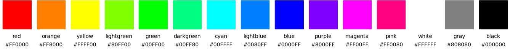
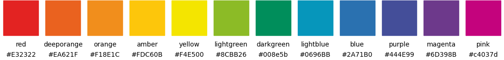
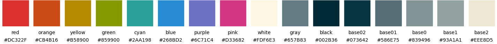

# Colors module

Make sure you know about

- [matplotlib color maps](https://matplotlib.org/3.1.0/tutorials/colors/colormaps.html)
- [Palettable](https://jiffyclub.github.io/palettable): many beautiful color palettes


Load the color module:
```
import plottools.colors as c
```

## Color palettes

The color module provides a few color palettes as dictionaries that
reference colors by standard color names. For example:
```
c.colors_muted['red']
```
returns the red color of the `colors_muted` palette. The returned
colors are valid matplotlib colors and can be passed on to `color`,
`facecolor`, `edgecolor`, etc. arguments of the various plotting
functions.

```
c.color
```
is a default color palette set to one of the available color palettes
(currently ```colors_muted```). Feel free to overwrite it.

```
c.color_palettes
```
is a dictionary referencing all color palettes provided by the module
by their name.

The following sections display the colors and their names of all provided palettes.


### Plain RGB colors

```
c.colors_plain
```



This palette is provided for completeness. The colors are made up of
either full or half saturated RGB values, e.g. red is '#ff0000', green
is '#00ff00', and orange is '#ff8000'.


### Muted colors

```
c.colors_muted
```


This palette extends the `colors_henninger` palette.


### Vivid colors

```
c.colors_vivid
```


Vivid but not plain basic colors for a fresh look.


### Color palette by J&ouml;rg Henninger

```
c.colors_henninger
```


### Color pallete of our Scientific Computing script

```
c.colors_scicomp
```


Nice red, orange and yellow, but blue and green need some improvement.


### Color palette of the corporate design of the University of T&uuml;bingen

```
c.colors_unituebingen
```


### Farbkreis by Johannes Itten, 1961

```
c.colors_itten
```




### Solarized colors by Ethan Schoonover (from LaTeX xcolor-solarized package)

```
c.colors_solarized
```




### Google's material color palette (from LaTeX xcolor-material package)

```
c.colors_material
```


## Color manipulation

### Lighter colors

Make colors lighter.


For 40% lightness of blue do
```
color = c.colors['blue']
lightblue = c.lighter(color, 0.4)
```


### Darker colors

Make colors darker.


For 40% darker blue do
```
color = c.colors['blue']
darkblue = c.darker(color, 0.4)
```


### Gradient between two colors

Mix two colors.


For 30% transition between blue and orange do
```
cb = c.colors['blue']
co = c.colors['orange']
color = c.gradient(cb, co, 0.3)
```


## LaTeX colors

If you want to use in your LaTeX document the same colors as in your plots,
then you can export matplotlib colors using the `latex_colors()` function.
Either for single colors:
```
c.latex_colors(c.colors['red'], 'red')
```
writes to the console
```
\definecolor{red}{rgb}{0.753,0.153,0.090}
```
or for a whole palette:
```
c.latex_colors(c.colors_vivid)
```
writes to the console
```
\definecolor{red}{rgb}{0.843,0.063,0.000}
\definecolor{orange}{rgb}{1.000,0.565,0.000}
\definecolor{yellow}{rgb}{1.000,0.969,0.000}
...
```
Then copy the color definitions into you LaTeX preamble. Do not forget to
load the `color` or `xcolor` packages before:
```
\usepackage{color}
```
You then can use the newly defined  colors with the usual commands, like for example:
```
\textcolor{red}{Some text in my special red.}
```


## Color maps

Generate and register a color map from colors like this:
```
cmcolors = [c.colors['red'], c.lighter(c.colors['orange'], 0.85),
            c.lighter(c.colors['yellow'], 0.2), c.lighter(c.colors['lightblue'], 0.8),
            c.colors['blue']]
cmvalues = [0.0, 0.25, 0.5, 0.8, 1.0]
c.colormap('RYB', cmcolors, cmvalues)
```
This is just a simple wrapper for
`matplotlib.colors.LinearSegmentedColormap` and `matplotlib.cm import
register_cmap`.

The new colormap can then be used directly by its name for the `cmap`
arguments of `imshow()`, `pcolormesh()`, `contourf()`, etc.:
```
ax.imshow(image, cmap='RYB')
```


Retrieve a single color from a color map:
```
jet_red = c.cmap_color('jet', 0.0)
```


## Display colors

For displaying colors and color maps, four functions are provided:

- `plot_colors()`: plot all colors of a palette and optionally some lighter and darker variants.
  
- `plot_complementary_colors()`: plot complementary colors of a palette on top of each other.
  
- `plot_color_comparison()`: plot matching colors of severals palettes on top of each other.
  
- `plot_colormap()`: plot a color map and its luminance.
  

These functions are helpfull when creating new palettes. See their
documentation for details on how to use them.


