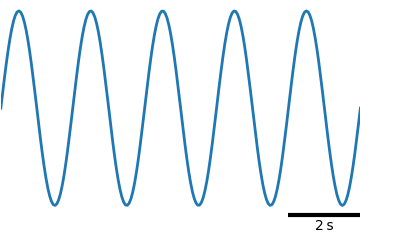
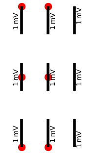

# Scalebars module

Scalebars are an alternative to xticks and yticks.
They visualizes scales by the length of a bar.


```
ax.scalebars(1.05, 0.0, 2, 1, 's', 'mV', ha='right', va='bottom')
```

Do *not* use scalebars if a specific value on the axis (most likely
zero!) has a special meaning!

The scalebar module installs the three functions

- `xscalebar()`
- `yscalebar()`
- `scalebars()`

on matplotlib axes for drawing and annotating horizontal or vertical scalebars, or both.

```
import matplotlib.pyplot as plt
import plottools.spines
from plottools.scalebars import scalebar_params

fig, ax = plt.subplots()
ax.show_spines('')
```

## X Scalebars

`xscalebar()` draws and annotates a horizontal scalebar, visualizing
the scale of the x-axis.



```
ax.xscalebar(1.0, 0.0, 2, 's', ha='right', va='bottom')
```

The first two arguments of the scalebar functions set the anchor point
on which the scalebar is positioned. The scalebar position is given in
relative coordinates of the axes (ranging from 0 to 1).

For horizontal scalebars, `ha` (horizontal
alignment) determines whether the anchor is on the 'left', 'center',
or 'right' of the scalebar. The vertical alignment (`va`) determines
whether the annotation is on top ('top') or below ('bottom') the
scalebar. In the figure the position of the scalebar, the anchor
point, is shown as a red circle.


```
ax.xscalebar(0.0, 0.8, 2, 's', ha='left', va='top')
ax.xscalebar(0.5, 0.8, 2, 's', ha='center', va='top')
ax.xscalebar(1.0, 0.8, 2, 's', ha='right', va='top')
ax.xscalebar(0.0, 0.3, 2, 's', ha='left', va='bottom')
ax.xscalebar(0.5, 0.3, 2, 's', ha='center', va='bottom')
ax.xscalebar(1.0, 0.3, 2, 's', ha='right', va='bottom')
```

The third argument sets the length of the scale bar in data
coordinates of the x-axis, followed by a string setting the unit of
the scale.


## Y Scalebars

`yscalebar()` draws and annotates a vertical scalebar, visualizing the
scale of the y-axis.


```
ax.yscalebar(1.05, 0.0, 1, 'mV', ha='right', va='bottom')
```

For vertical scalebars, `va` (vertical alignment) determines whether
the anchor is on the 'top', 'center', or 'bottom' of the scalebar. The
horizontal alignment (`ha`) determines whether the annotation is to
the 'left' or to the 'right' of the scale bar. In the figure the
position of the scalebar, the anchor point, is shown as a red circle.



```
ax.yscalebar(0.3, 1.0, 1, 'mV', ha='left', va='top')
ax.yscalebar(0.3, 0.5, 1, 'mV', ha='left', va='center')
ax.yscalebar(0.3, 0.0, 1, 'mV', ha='left', va='bottom')
ax.yscalebar(0.7, 1.0, 1, 'mV', ha='right', va='top')
ax.yscalebar(0.7, 0.5, 1, 'mV', ha='right', va='center')
ax.yscalebar(0.7, 0.0, 1, 'mV', ha='right', va='bottom')
```

## X-Y Scalebars

`scalebars()` draws and annotates both a horizontal and a vertical
scalebar, visualizing the scale of the x- and the y-axis.  Horizontal
alignment (`ha`) determines whether the anchor point and the vertical
scalebar is on the 'left' or on the 'right' of the horizontal
scalebar. Vertical alignment (`va`) determines whether the anchor
point and the horizontal scalebar are at the 'top' or 'bottom' of the
vertical scalebar. In the figure the position of the scalebar, the
anchor point, is shown as a red circle.


```
ax.scalebars(0.2, 0.8, 2, 1, 's', 'mV', ha='left', va='top')
ax.scalebars(0.8, 0.8, 2, 1, 's', 'mV', ha='right', va='top')
ax.scalebars(0.2, 0.1, 2, 1, 's', 'mV', ha='left', va='bottom')
ax.scalebars(0.8, 0.1, 2, 1, 's', 'mV', ha='right', va='bottom')
```


## Styles

The line width and the color of the scalebar can be set by the `lw`
and `color` keyword arguments.

The horizontal and vertical scalebars can have in addition start and
stop markers. These are lines perpendicular to the scalebar line. Half
of their length is set by `capsize` and their width by `clw`.


```
ax.xscalebar(0.0, 0.8, 2, 'mm', ha='left', va='bottom', lw=3)
ax.xscalebar(0.0, 0.3, 2, 'mm', ha='left', va='bottom', lw=6)
ax.xscalebar(1.0, 0.8, 2, 'mm', ha='right', va='bottom', lw=4, capsize=4, clw=2)
ax.xscalebar(1.0, 0.3, 2, 'mm', ha='right', va='bottom', lw=4, capsize=6, clw=1)
```

Use the `scalebar_params()` function to modify default rc settings
defining the style of the scalebars:
```
scalebar_params(format_large='%.0f', format_small='%.1f', lw=3, capsize=0, clw=0.5)
```
Ideally you use the scalebar functions without specifying the `lw`,
`color`, `capsize`, `clw`, and `font` arguments and control them by a
central call to `scalebar_params()`.