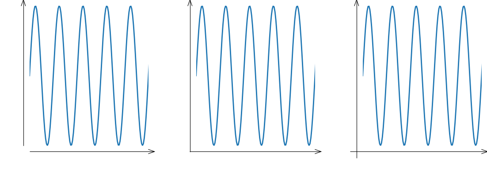

# Spines module

Control spine visibility, bounds (extend of spine), position
(moving it outward or inward), and arrows.

```
import matplotlib.pyplot as plt
from plottools.spines import spines_params

spines_params('lb')
fig, (ax0, ax1, ax2) = plt.subplots(1, 3)
```

## Spine visibility

The `ax.show_spines()` functions controls visibility of spines and
modifies tick and label positions accordingly.


```
ax0.show_spines('lb')
ax1.show_spines('bt')
ax2.show_spines('tr')
```

## Spine bounds

The length of the spine can span

- the full length of the axis as set by the axis's limits ('full'),
- the extend of the data ('data'),
- the range between the minimum and maximum tick location ('ticks').
- or any other range on the corresponding axis.


```
ax0.set_spines_bounds('lb', 'full')
ax1.set_spines_bounds('lb', 'data')
ax2.set_spines_bounds('lb', 'ticks')
```

## Spine position

Spines can be moved outward (positive offset in points)
or inward (negative offset).


```
ax0.set_spines_outward('lb', 0)
ax1.set_spines_outward('lb', 10)
ax2.set_spines_outward('lb', -10)
```

## Arrowed spines

Spines can get an arrow head.



```
spines_params(spines='', height=10)
ax0.arrow_spines('lb')
ax1.arrow_spines('lb', flush=1.0)
ax2.arrow_spines('lb', flush=2.0)
```


## Default spine appearance

The `spines_params()` controls the default appearance of spines.

